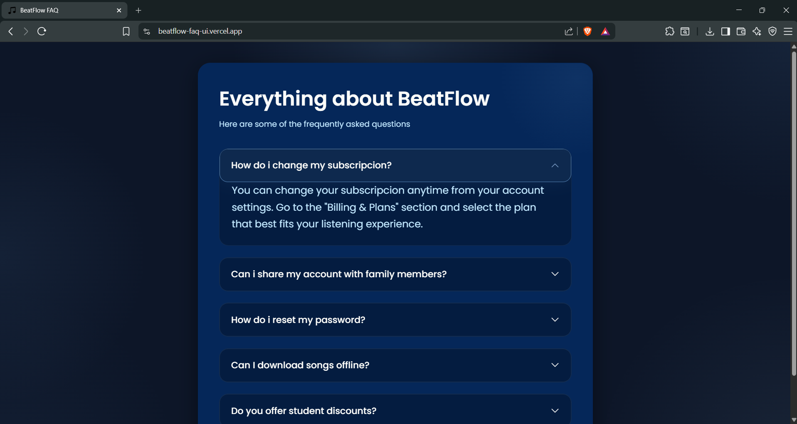

<h1 align="center">BeatFlow — Streaming Platform FAQ</h1>

A modern and responsive FAQ accordion interface for a fictional music streaming platform called **BeatFlow**.  
Built with **HTML, CSS and JavaScript** featuring smooth animations, dark mode UI, glowing hover effects and interactive accordion behavior.

---

## Features
-  Modern streaming platform inspired UI
-  Dark mode design
-  Smooth accordion animations
-  Glowing hover effects
-  Fully responsive layout
-  Interactive FAQ behavior with JavaScript
-  Clean and modern typography
-  Deployed with Vercel

---

## Technologies Used
- HTML5
- CSS3
- JavaScript
- Bootstrap Icons
- Google Fonts

---

## Preview

<div align="center">
  
</div>

---

##  Live Demo
https://beatflow-faq-ui.vercel.app

---

## Project Structure
```bash
beatflow-faq-ui/
│
├── assets/        # Icons and resources
├── index.html     # Main structure
├── styles.css     # FAQ styles
└── main.js        # FAQ logic
└── README.md      # Project documentation
```

---

## Getting Started

Clone the repository:

```bash
git clone https://github.com/ByronDev03/beatflow-faq-ui.git
```

Open the project folder:

```bash
cd beatflow-faq-ui
```

Then simply open `index.html` in your browser.

---

## Project Goal
**This project was created to practice and improve frontend development skills including:**
- DOM manipulation
- Event handling
- Responsive design
- CSS transitions and animations
- UI/UX improvements
- Interactive components

---

## Author
*Developed by Byron Jorge Ortega Cuenca*